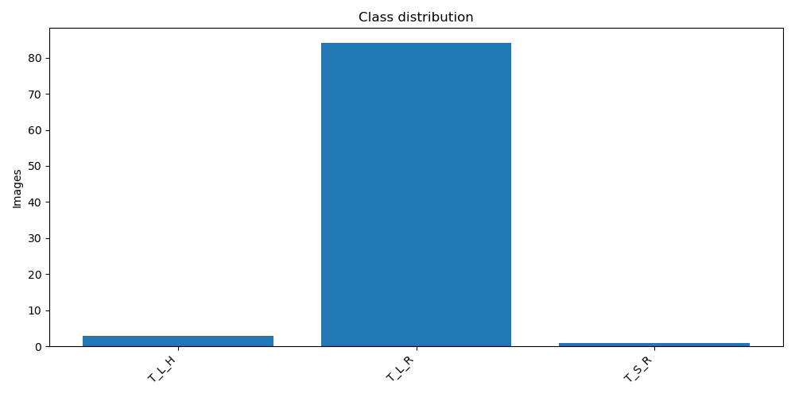
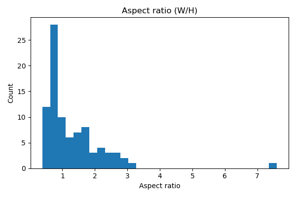

# Tomate Rugoso Clasificación

## Summary

- **Task:** classification

- **Images:** 88

- **Classes:** 3

- **URL:** file:///C:/Users/Berries/Documents/Repos/databaseMLUtils/DATABASEMLUTILS/report

## Classes
- T_L_H: 3
- T_L_R: 84
- T_S_R: 1

## Counts & Stats
- Estimated duplicate images: **2**
- Color summary: {'color': 88}
- Top resolutions (WxH, count): [['430x586', 1], ['229x433', 1], ['158x253', 1], ['450x716', 1], ['1044x433', 1], ['572x253', 1], ['427x736', 1], ['295x411', 1], ['1055x552', 1], ['427x745', 1]]
- Width [min/mean/median/max]: 65.0/459.1/353.0/1574.0
- Height [min/mean/median/max]: 81.0/426.6/394.5/1018.0
- Aspect ratio [min/mean/median/max]: 0.383/1.301/0.956/7.598

## Class distribution

## Aspect ratio

## Examples (thumbnails)
**T_L_H**
  

**T_L_R**
     

**T_S_R**

## Notes
- Add license information here if available.
- Folder structure follows 'one folder per class'.