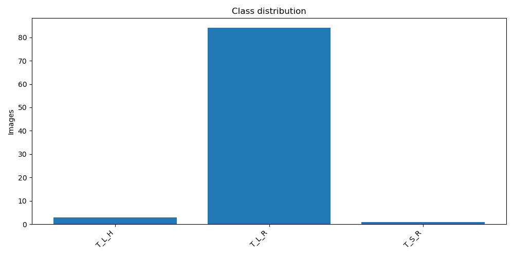
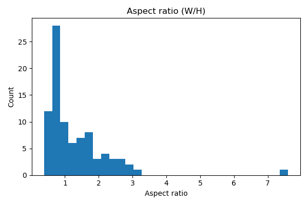

# Tomate Rugoso Clasificación

## Overview

> **Objective:** TODO: Describe the goal of this dataset. Why it was collected? What problem does it solve?

> **Domain:** TODO: Agriculture / Medical / Industrial / etc.

> **Source:** TODO: Add collection method, instruments, or references.


## Summary

- **Task:** Classification

- **Images:** 88

- **Classes:** 3

- **URL:** file:///C:/Users/Berries/Documents/Repos/databaseMLUtils/DATABASEMLUTILS/report


## Dataset Structure

```

root/

  class1/
  class2/

```

Each class folder contains raw image files.


## Classes

- **T_L_H** (3 images) — TODO: Describe T_L_H
- **T_L_R** (84 images) — TODO: Describe T_L_R
- **T_S_R** (1 images) — TODO: Describe T_S_R

## Statistics

- Estimated duplicate images: **2**
- Color summary: {'color': 88}
- Top resolutions: [['430x586', 1], ['229x433', 1], ['158x253', 1], ['450x716', 1], ['1044x433', 1], ['572x253', 1], ['427x736', 1], ['295x411', 1], ['1055x552', 1], ['427x745', 1]]
- Width [min/mean/median/max]: 65.0/459.1/353.0/1574.0
- Height [min/mean/median/max]: 81.0/426.6/394.5/1018.0
- Aspect ratio [min/mean/median/max]: 0.383/1.301/0.956/7.598

## Class Distribution



## Aspect Ratio Histogram



## Example Images

**T_L_H**

  

**T_L_R**

     

**T_S_R**


## Usage

```python

# TODO: Add code snippet to load and use dataset (PyTorch / TensorFlow / etc.)

```

## Citation

If you use this dataset, please cite:

```
TODO: BibTeX or reference
```

## License

TODO: Add license information (MIT, CC-BY, proprietary, etc.)
